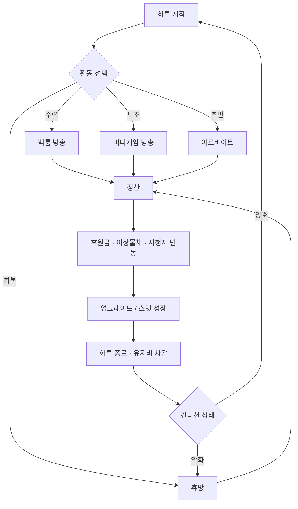
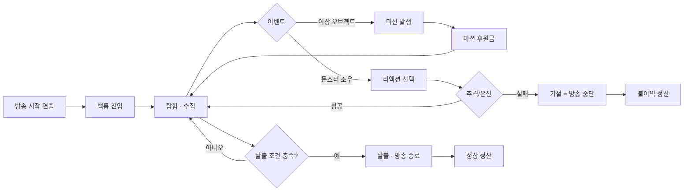
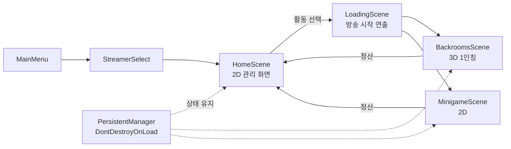
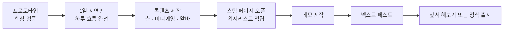

# 프로젝트 R — 게임 기획서

버추얼 스트리머 육성 × 백룸 탐험 호러
Version 0.2 · 2026.08

---

## 1. 개요

| 항목 | 내용 |
|---|---|
| 프로젝트명 | 프로젝트 R (가칭) |
| 장르 | 육성 시뮬레이션 + 1인칭 서바이벌 호러 |
| 플랫폼 | PC (Steam) |
| 엔진 | Unity |
| 플레이 인원 | 싱글플레이 |
| 시점 | 백룸 = 3D 1인칭 / 그 외 = 2D |
| 목표 구조 | 엔드리스 성장형 (엔딩 없음) |
| 확장 계획 | DLC로 스트리머 추가 |

### 1.1 한 줄 요약

버추얼 방송인이 되어 이상세계 백룸을 생중계하고, 후원금으로 자신을 성장시키는 육성 시뮬레이션.

### 1.2 핵심 재미

이 게임의 재미는 개별 콘텐츠가 아니라 스트리머를 성장시키는 과정에 있다. 백룸 탐험은 가장 위험하고 가장 수익성 높은 활동이지만, 어디까지나 성장을 위한 수단이다.

플레이어가 느껴야 할 감정은 "무섭다"보다 "오늘 하루를 어떻게 굴릴까"에 가깝다.

### 1.3 차별점

| 축 | 내용 |
|---|---|
| 버추얼 정체성 | 캐릭터를 연기한다는 설정이 시스템으로 작동 (컨셉 유지 시스템) |
| 실시간 방송 압박 | 시청자·채팅·후원이 플레이 도중 실시간으로 개입 |
| 육성이 중심 | 탐험 반복형 호러가 아니라, 호러를 자원 삼는 육성 시뮬레이션 |
| 2D/3D 이중 구조 | 관리 화면은 2D, 방송 현장은 3D 1인칭 |

---

## 2. 설계 원칙

기획 판단이 갈릴 때 아래를 기준으로 결정한다.

1. **탐험과 육성이 서로를 바꿔야 한다.** 탐험 결과가 육성 수치에만 반영되고 끝나면 안 된다. 업그레이드는 반드시 백룸 플레이 감각을 바꿔야 한다.
2. **살아남기와 재미있기는 충돌해야 한다.** 안전한 플레이는 수익이 낮고, 위험한 플레이는 시청자가 몰린다. 플레이어가 스스로 위험을 선택하게 만든다.
3. **쉬면 채널이 죽고, 안 쉬면 몸이 죽는다.** 엔드리스에는 마감 기한이 없다. 이 충돌이 시간 압박을 대신한다.
4. **실패는 아프되 회복 가능해야 한다.** 실패가 실패를 부르는 구조를 만들지 않는다. 모든 불이익에 하한선을 둔다.
5. **성장은 눈에 보여야 한다.** 수치만 오르는 성장은 엔드리스에서 반드시 지루해진다.

---

## 3. 게임 흐름

### 3.1 전체 구조



### 3.2 백룸 탐험 흐름



### 3.3 성장 순환

```
수집 ──▶ 업그레이드 ──▶ 더 깊은 층 진입 ──▶ 더 좋은 수집
  ▲                                              │
  └──────────────────────────────────────────────┘
                      │
                시청자 증가
                      │
                유지비 증가 ──▶ 성장을 멈추면 후퇴한다
```

---

## 4. 시간 시스템

### 4.1 하루 구조

하루는 활동 시간대로 나뉜다. 백룸 탐험도 시간대 하나를 쓰는 활동 중 하나로 취급한다.

```
[ 오전 ]  [ 오후 ]  [ 저녁 ]  [ 심야 ]
   │         │         │         │
   └─ 알바   └─ 방송   └─ 방송   └─ 휴식/자유
```

### 4.2 진행에 따른 하루 변화

| 단계 | 알바 | 방송 시간대 | 백룸 접근 | 특징 |
|---|---|---|---|---|
| 초반 | 필수 | 1회 (짧음) | 1층만 | 생계 압박, 방송 시간 부족 |
| 중반 | 선택 | 2회 | 중층 | 시간대 배분이 핵심 고민 |
| 후반 | 없음 | 2~3회 (장시간) | 심층 | 알바 자리를 광고·협업이 대체 |

첫 번째 목표 지점은 알바 탈출이다. "이제 방송만으로 먹고산다"는 순간을 게임 초반에 배치한다. 스팀 환불 기준이 플레이 2시간이므로, 이 구간이 판매와 직결된다.

### 4.3 방송 시간

- 방송 시간은 하루치 행동력이다. 활동에 들어갈 때 그 활동에 정해진 만큼 한 번에 소비된다.
- 활동 안에는 제한 시간이 없다. 백룸에서 시간에 쫓겨 강제 종료되는 일은 없다. (2026.08.28 변경 · 진행기록 10.9절)
- 방송 시간은 채널 등급이 오르면 늘어난다.
- 탐험 실패 시 다음 날 방송 시간이 줄어든다. 단 하한선을 둔다.

---

## 5. 컨디션 시스템

컨디션은 네 개 수치를 묶은 상위 개념이다. 각각이 서로 다른 방식으로 백룸 플레이에 개입한다.

| 수치 | 회복 수단 | 백룸에서의 효과 |
|---|---|---|
| 수면 | 잠 (시간 소모 큼) | 낮으면 시야 흐림, 헛것이 보임 |
| 배고픔 | 식사 (돈 소모) | 낮으면 달리기 지속 시간 급감 |
| 기분 | 좋은 방송, 오락 활동 | 낮으면 리액션 판정 둔화, 시청자 반응 하락 |
| 피로도 | 휴방 (수일 소요) | 나머지 세 수치의 최대치를 눌러 내림 |

피로도는 연속 방송으로 쌓이고 휴방으로만 풀린다. 피로도가 높으면 수면·배고픔·기분을 아무리 채워도 최대치 자체가 낮아진다. 휴방하면 구독자가 빠지고, 휴방하지 않으면 백룸 성능이 무너진다.

컨디션은 수치판으로만 존재하면 관리 노동이 된다. 반드시 3D 플레이에서 체감되도록 만든다.

---

## 6. 방송 시스템

### 6.1 수익 구조

```
시청자 수 × 방송 재미 = 후원금
     │           │
     │           └─ 위험한 행동, 미션 클리어, 이상물체 공개로 상승
     └─ 채널 등급, 방송 지속, 컨셉 일관성으로 축적
```

| 상태 | 시청자 | 후원 |
|---|---|---|
| 안전한 곳에 은신 | 이탈 | 없음 |
| 탐험 중 | 유지 | 소액 |
| 미션 수행 | 상승 | 미션 보상 |
| 몬스터 추격 중 | 급증 | 폭발 |
| 이상물체 공개 | 급증 | 대량 |

### 6.2 컨셉 유지 시스템

본 게임의 최대 차별화 요소다. 스트리머는 캐릭터를 연기하는 중이다. 몬스터 조우 등 위기 상황에서 리액션을 선택한다.

```
        ┌─────────────────────────────┐
        │      몬스터 조우 발생        │
        └──────────────┬──────────────┘
                       │
        ┌──────────────┴──────────────┐
        ▼                             ▼
┌───────────────────┐      ┌───────────────────┐
│   컨셉 유지 대사    │      │    날것의 비명     │
├───────────────────┤      ├───────────────────┤
│ 고정 팬 증가       │      │ 순간 시청자 폭증   │
│ 장기 수익 안정     │      │ 클립 확산          │
│ 기분 유지          │      │ 일부 팬 이탈       │
│ 즉시 수익 낮음     │      │ 기분 하락          │
└───────────────────┘      └───────────────────┘
```

이 시스템이 있으면 성장이 수치 올리기에서 "어떤 스트리머로 키울 것인가"라는 선택으로 바뀐다.

### 6.3 채팅 시스템

상황 태그와 템플릿을 조합하는 방식을 주력으로 쓴다. 안정적이고 비용이 없으며 오프라인에서도 동작한다. 문장 생성은 미션 문구처럼 빈도가 낮고 인상이 강한 곳에만 제한적으로 검토한다. 서버 통신 방식은 운영비와 오프라인 문제로 채택하지 않는다.

상황 태그 예시: 공포, 실수, 성공, 침묵, 컨셉붕괴, 수집, 추격, 탈출

채팅은 문장 품질보다 흐름이 반응하는 느낌이 중요하다. 태그와 템플릿 조합만으로 대부분의 체감이 나온다.

> 스팀 정책 확인 필요: 실행 중 문장을 생성하는 방식은 스토어 페이지에 공개 신고 의무가 있고, 부적절 출력 방지 대책 설명도 요구된다. 생성 방식 사용 범위를 좁힐수록 실무가 단순해진다.

### 6.4 미션 시스템

탐험 중 이상 오브젝트를 발견하면 발생한다. 모든 미션은 "재미 수치를 올려주는 대신 위험한 행동"으로 통일한다.

| 유형 | 예시 |
|---|---|
| 탐색 | 특정 오브젝트 찾아오기 |
| 상호작용 | 던지기, 만지기, 열어보기 |
| 도전 | 제한 시간 내 특정 지점 도달 |
| 금기 | 뒤돌아보지 않기, 소리 내지 않기 |

### 6.5 화면 구조

방송 화면이 3D 위에 겹쳐 표시된다. 이 겹침 자체를 공포 장치로도 쓴다.

```
┌────────────────────────────────────────────┐
│  시청자 12,483          방송 24:17 남음    │
│                                            │
│                                            │
│           [ 3D 백룸 1인칭 화면 ]            │
│                                            │
│                              ┌───────────┐ │
│  ┌──────────────────────┐    │  2D 아바타 │ │
│  │ 채팅                 │    │   (캠)    │ │
│  │ 시청자1: 뒤에 뭐야    │    └───────────┘ │
│  │ 시청자2: ㅋㅋㅋㅋ      │                 │
│  └──────────────────────┘                  │
│                                            │
│      후원 알림이 화면을 덮는 순간           │
│      뒤에서 무언가 지나간다                 │
└────────────────────────────────────────────┘
```

---

## 7. 백룸 시스템

### 7.1 맵 생성

현재 방침은 재귀적 백트래킹 미로 생성이다. 다만 아래 보정을 반드시 함께 적용한다.

| 재귀적 백트래킹의 문제 | 보정 방식 |
|---|---|
| 막다른 길이 과하게 생김 | 막다른 길 비율 상한을 두고, 넘으면 벽을 허문다 |
| 순환로가 없어 벽 짚기로 공략됨 | 생성 후 벽 일부를 무작위 제거해 순환로를 만든다 |
| 구조가 명확해 무한 반복 감각이 없음 | 방·복도 프리팹 단위 배치와 랜드마크로 보완한다 |

향후 교체 후보:

| 순위 | 방식 | 장점 | 단점 |
|---|---|---|---|
| 1 | WFC | 백룸 질감에 가장 적합, 층별 타일셋 교체만으로 개성 확보, 조명 굽기 유지 | 제약이 빡세면 생성 실패 |
| 2 | BSP + 순환로 연결 | 구현 단순, 결과 예측 쉬움, 홀과 복도의 리듬 | 개성 부족 |
| 3 | 방 이어붙이기 | 가장 단순하고 통제력이 높음 | 확장성 낮음 |

### 7.2 생성 시 공통 필수 요소

- 순환로 최소 개수 강제
- 막다른 길 비율 상한, 초과 시 벽 허물기
- 생성 후 탈출 경로 도달 가능성 검증, 실패 시 재생성
- 구역마다 알아볼 수 있는 랜드마크 배치
- 시드 저장. 없으면 생성 버그를 재현할 수 없다

### 7.3 조명 및 성능

이 프로젝트의 최대 기술 위험이다. 절차적 생성과 형광등 조명은 정면으로 충돌한다. 실행 중에 맵을 만들면 조명을 미리 구울 수 없고, 실시간 조명을 많이 켜면 프레임이 무너진다.

해법은 프리팹 단위로 미리 굽고 실행 중에는 조립만 하는 방식이다.

```
[사전 작업]                    [실행 중]

프리팹 A ─ 조명 굽기 완료  ──▶  ┌───┬───┬───┐
프리팹 B ─ 조명 굽기 완료  ──▶  │ A │ C │ B │
프리팹 C ─ 조명 굽기 완료  ──▶  ├───┼───┼───┤
                                │ B │ A │ A │  ← 조립만 수행
                                ├───┼───┼───┤
                                │ C │ B │ C │
                                └───┴───┴───┘
                                  △
                                  └─ 이음새만 프로브 보정
```

프로토타입 1단계에서 가장 먼저 검증한다. 여기서 실패하면 생성 방식 자체를 바꿔야 한다.

### 7.4 층 차별화

깊이만 깊어지는 구조는 금방 반복감이 온다. 아래 네 축을 조합해 층마다 다른 규칙을 준다.

| 축 | 변주 예시 |
|---|---|
| 몬스터 유형 | 소리 추적 / 시각 추적 / 정지하면 안전 / 쳐다보면 안 됨 |
| 자원 압박 | 배터리 소모 가속 / 산소 / 구역별 체류 시간 제한 |
| 감각 제한 | 완전 어둠 / 소음으로 발소리 은폐 / 시야 왜곡 |
| 공간 규칙 | 뒤돌아보면 구조 변경 / 같은 길 반복 / 수중 |

층 설계 예시:

```
1층 │ 기본형        │ 시각 추적 몬스터 1종
3층 │ 어둠          │ 소리 추적 + 배터리 소모 가속
5층 │ 구조 변경     │ 뒤돌아보면 길이 바뀜 + 정지 시 안전 몬스터
7층 │ 신호 불안정   │ 시청자 이탈 가속 → 빠른 귀환 강제
```

7층 예시처럼 방송 조건을 바꾸는 변주는 층 자체가 수익 구조를 바꾸므로 육성 시스템과 직접 연결된다.

### 7.5 몬스터 AI

플레이어는 내부 로직을 볼 수 없다. 실제 판단력보다 판단력이 있어 보이는 연출이 체감을 만든다.

| 요소 | 구현 | 플레이어가 받는 인상 |
|---|---|---|
| 기억 | 마지막 목격 위치 주변에 수색 가중치 | 내가 어디 있었는지 안다 |
| 매복 | 추격을 포기한 척 물러났다가 출구 근처 대기 | 기다리고 있었다 |
| 학습한 척 | 자주 쓴 은신처를 우선 확인 | 여기도 알고 있다 |
| 정보 노출 | 몬스터의 행동이 소리로 간접 전달 | 지금 뭘 하는지 알겠다 |

가장 강한 연출은 발소리가 멀어지다가 멈추는 순간이다. 그 정적 하나가 복잡한 AI보다 강력하다.

기술적으로는 NavMesh와 수색 지점 가중치, 소리 이벤트 정도면 위 연출이 모두 나온다. 몬스터 판단 로직보다 소리 설계에 먼저 투자한다.

### 7.6 인벤토리

칸 기반 격자 인벤토리를 쓴다. 무게 개념은 넣지 않는다.

```
┌───┬───┬───┬───┬───┬───┐
│███│███│   │▓▓▓│▓▓▓│▓▓▓│   ███ 2x2
├───┼───┼───┼───┼───┼───┤   ▓▓▓ 3x2
│███│███│   │▓▓▓│▓▓▓│▓▓▓│   ░░░ 1x1
├───┼───┼───┼───┼───┼───┤   ▒▒▒ 1x4
│░░░│░░░│   │   │   │   │
├───┼───┼───┼───┼───┼───┤
│▒▒▒│▒▒▒│▒▒▒│▒▒▒│   │   │
└───┴───┴───┴───┴───┴───┘
```

이상물체는 형태를 제각각으로 만들어 정리하는 재미를 유도한다. 가방 용량은 초반 성장 체감이 가장 큰 업그레이드이므로 우선순위를 높게 잡는다.

### 7.7 실패 시 불이익

| 항목 | 처리 |
|---|---|
| 인벤토리 | 전부 소실 |
| 후원금 | 일시 차감 |
| 방송 시간 | 다음 날 감소 (하한선 있음) |
| 컨디션 | 하락 |

네 가지가 동시에 걸리므로 엔드리스 기준으로는 상당히 무거운 편이다. 테스트에서 복귀 의욕 저하가 보이면 아래 순서로 완화한다.

1. 방송 사고 클립 보상 — 기절 방송분이 다음 날 조회수 보너스로 돌아온다
2. 회수 기회 — 다음 탐험에서 기절 지점에 도달하면 일부 회수
3. 보험 업그레이드 — 후원금으로 구매하는 소실 방어
4. 일부 소실로 전환 — 가방 절반 또는 고가품 우선

---

## 8. 재화 및 경제

### 8.1 이원 재화 구조

```
┌──────────────────────┐        ┌──────────────────────┐
│     후원금 (현금)     │        │  이상물체 (수집물)    │
├──────────────────────┤        ├──────────────────────┤
│ 획득: 모든 방송 활동  │        │ 획득: 백룸 전용       │
│                      │        │                      │
│ 사용:                │        │ 사용:                │
│  · 월세 / 생활비      │        │  · 장비 제작 / 강화   │
│  · 일반 업그레이드    │        │  · 심층 진입 조건     │
│  · 식사 / 회복        │        │  · 특수 해금          │
│                      │        │  · 방송 공개 (소모)   │
│                      │ ◀──────│ 급매 (환율 나쁨)      │
└──────────────────────┘        └──────────────────────┘
```

재화를 나누는 목적은 안전한 미니게임 반복이라는 최적 전략을 막는 것이다. 이상물체는 돈으로 살 수 없으므로 성장하려면 반드시 백룸에 들어가야 한다.

### 8.2 이상물체의 세 가지 용도

| 용도 | 내용 |
|---|---|
| 장비 재료 | 제작 및 강화에 소모 |
| 방송 공개 | 시청자 급증과 후원 대량 발생. 물체가 소모되고 위험이 따른다 |
| 급매 | 현금화. 환율이 나쁘게 설정되어 급할 때만 쓰게 된다 |

수집이 방송으로, 방송이 성장으로 이어진다.

### 8.3 유지비

엔드리스에는 마감 기한이 없다. 유지비가 그 압박을 대신한다.

| 항목 | 내용 |
|---|---|
| 구독자 이탈 | 방송을 쉬면 감소. 재미없는 방송도 감소 |
| 고정 지출 | 월세, 생활비, 식비 |
| 규모 비례 | 채널이 클수록 유지 난이도 상승 |

성장을 멈추면 후퇴하는 구조를 만든다.

### 8.4 수치 폭주 대응

- 스탯에 상한선을 둔다
- 시청자 수는 일정 구간 이후 상승이 극도로 완만해진다. 초고수치 달성은 히든 업적으로 처리한다
- 후원금은 선형으로 늘고, 업그레이드 비용은 완만한 지수로 늘어 자연 수렴시킨다
- 실수치보다 등급 표기를 함께 쓴다 (10만 → "대형 채널")

---

## 9. 성장 및 업그레이드

### 9.1 네 가지 성장 축

| 축 | 항목 예시 | 영향 |
|---|---|---|
| 신체 스탯 | 체력, 담력, 순발력 | 백룸 탐험 성능에 직접 |
| 방송 스탯 | 입담, 리액션, 편집 | 시청자·후원 배율 |
| 장비 | 손전등, 카메라, 마이크, 가방 | 탐험 중 정보량·안전·용량 |
| 채널 | 등급, 방송 시간 해금, 아바타 모델 | 하루 구조 자체를 확장 |

아바타 모델 업그레이드는 스크린샷과 클립 공유를 유도하는 홍보 자산이기도 하다. 우선순위를 높게 잡는다.

### 9.2 시그널 등급

엔딩이 없으므로 눈에 보이는 계단이 그 역할을 대신한다.

```
브론즈 시그널 ──▶ 실버 시그널 ──▶ 골드 시그널 ──▶ ...
```

트로피 형태로 지급되어 방에 배치된다.

금속 등급 명칭은 게임 티어라는 인상이 강해 이상세계 분위기와 다소 어긋난다. 상위 등급만이라도 신호 상태 명칭으로 바꾸면 후반부에 분위기가 전환되는 효과를 얻을 수 있다. 예: 잡음 → 미약 → 수신 → 간섭 → 공명 → 동기화. 검토 사항으로 남긴다.

### 9.3 발신인 불명의 소포

시그널 트로피는 발신인 없는 택배로 집 앞에 도착한다. 플레이어는 그것을 방에 놓는다.

- 방이 물건으로 채워지면서 성장이 공간으로 보인다
- 물건이 늘수록 방이 미묘하게 이상해진다. 조명 색, 벽 얼룩, 창밖 풍경
- 누가 보내는지는 밝히지 않는다. 확장 여지로 남긴다

### 9.4 그 외 목표 지점

- 백룸 층 최초 도달. 층 자체가 진도 역할을 한다
- 해금. 새 방송 카테고리, 협업, 굿즈, 오프라인 이벤트 등 하루 구조가 넓어진다
- 히든 업적. 초고수치 달성, 특수 조건 클리어

---

## 10. 그 외 활동

백룸 시스템 완성 후 설계한다. 여기서는 방향만 정한다.

### 10.1 미니게임 방송 (2D)

| 항목 | 내용 |
|---|---|
| 형식 | 2D |
| 제한 | 일일 플레이 횟수 제한 |
| 목적 | 안전한 수익원, 기분 회복, 콘텐츠 다양성 |
| 최소 종류 | 5~6종 |

횟수 제한을 그대로 노출하면 모바일 게임의 피로도 시스템처럼 보인다. "몇 번 남았다"가 아니라 "오늘 시간대를 무엇으로 채울까"라는 선택으로 보여준다. 같은 제약이지만 체감이 다르다.

### 10.2 아르바이트 (2D)

간단한 2D 미니게임으로 초반 생계를 해결한다. 중반 이후 광고·협업 시간대로 대체되어 사라진다.

게임 초반 인상을 좌우하는 구간이므로 품질 관리가 필요하다.

### 10.3 휴방

컨디션 회복 전용 시간대다. 회복 활동을 선택한다.

| 활동 | 회복 |
|---|---|
| 수면 | 수면 |
| 식사, 외식 | 배고픔, 기분 |
| 오락 | 기분 |
| 완전 휴식 | 피로도 |

대가는 구독자 이탈이다.

---

## 11. 저장 시스템

### 11.1 기본 방침

| 항목 | 처리 |
|---|---|
| 활동 도중 저장 | 불가 |
| 활동 도중 강제 종료 | 활동 시작 시점으로 되돌림 |
| 적용 범위 | 백룸, 미니게임, 알바 등 모든 활동 공통 |
| 저장 시점 | 활동 정산 완료 시점, 하루 종료 시점 |

되돌리기 방식이면 강제 종료나 크래시로 손실이 생기지 않고, 위기 상황에서 강제 종료로 도망쳐도 얻는 것이 없다.

다만 방송 시간 소비 여부는 명확히 정해야 한다. 방송 시간까지 되돌리면 위기 회피 수단이 되므로, 방송 시간은 소비 처리한다.

### 11.2 저장 데이터 구조

```
SaveData
├─ ChannelProgress          채널 진행도 (공용)
│  ├─ 날짜, 자금, 유지비
│  └─ 해금 상태, 업적
│
└─ StreamerProgress[]       스트리머별 진행도 (분리)
   ├─ streamerId
   ├─ 스탯, 컨디션
   ├─ 인벤토리, 장비
   ├─ 시청자 수, 시그널 등급
   └─ 진행 층수
```

분리하는 이유는 DLC 스트리머 추가 때문이다. 12장 참조.

---

## 12. 데이터 구조 및 확장성

### 12.1 출시 계획

정식 출시는 스트리머 1명으로 한다. 이후 DLC로 한 명씩 추가한다.

### 12.2 스트리머 선택 구조

```
┌─────────────────────────────────────────┐
│           스트리머 선택 화면              │
├─────────────────────────────────────────┤
│  ┌────────┐  ┌────────┐  ┌────────┐    │
│  │ 아바타A │  │ 아바타B │  │  잠김   │    │
│  │ Lv.24  │  │ Lv.3   │  │  DLC   │    │
│  │ 골드   │  │ 브론즈  │  │        │    │
│  └────────┘  └────────┘  └────────┘    │
│                                         │
│  각 스트리머는 독립된 진행도를 가진다      │
└─────────────────────────────────────────┘
```

### 12.3 필수 아키텍처 규칙

아래를 지키지 않으면 DLC 자체가 불가능해진다.

- 스트리머 정의를 전부 ScriptableObject로 외부화한다
- 저장 데이터를 채널 진행도와 스트리머별 진행도로 분리한다
- 출시 스트리머 1명도 여러 명 중 하나인 것처럼 데이터를 짠다. 하드코딩된 요소가 하나라도 있으면 이후 추가가 막힌다

### 12.4 스트리머 데이터 항목

```
StreamerData (ScriptableObject)
├─ 식별
│  ├─ streamerId
│  └─ displayName
├─ 성능
│  ├─ 초기 스탯 (체력, 담력, 순발력, 입담, 리액션)
│  ├─ 성장 계수
│  ├─ 스탯 상한
│  └─ 고유 특성 (예: 담력 높고 입담 낮음, 특정 몬스터 내성)
├─ 표현
│  ├─ 2D 아바타 에셋 세트
│  ├─ 표정 / 리액션 세트
│  └─ 컨셉 유형 (컨셉 유지 시스템 연동)
└─ 콘텐츠
   ├─ 전용 대사 모음
   ├─ 전용 채팅 템플릿
   └─ 전용 미니게임 유무
```

### 12.5 활동 공통 규격

백룸을 게임 전체인 것처럼 만들면 이후 미니게임과 알바를 붙일 때 반드시 다시 짜게 된다. 백룸부터 개발하되, 처음부터 여러 활동 중 하나라는 껍데기 안에 넣는다.

```
IActivity (모든 활동 공통)
├─ 소요 시간대
├─ 진입 조건
├─ 실행
└─ 종료 시 ActivityResult 반환

ActivityResult
├─ 후원금 변동
├─ 시청자 수 변동
├─ 컨디션 변동 (수면/배고픔/기분/피로)
├─ 획득 아이템 목록
└─ 특수 플래그 (실패 여부, 업적 조건 등)
```

백룸도 예외 없이 이 규격을 따른다.

### 12.6 씬 구조



전환은 `LoadSceneMode.Single`과 로딩 화면으로 처리한다. 상태는 씬에 두지 않고 `DontDestroyOnLoad` 매니저나 별도 데이터 계층에 둔다.

방송 시작 연출은 매번 반복되는 구간이라 투자 대비 효율이 높다. 카운트다운, 채팅창 등장, 시청자 수 상승 애니메이션을 이 구간에 배치한다.

---

## 13. 아트 및 사운드

### 13.1 아트 방향

| 영역 | 방향 |
|---|---|
| 백룸 (3D) | 이상세계 컨셉. 원본 백룸 색감을 참고하되 자체 해석 |
| 아바타 (2D) | 버추얼 스트리머 캠 스타일. 표정 변화 다양성 확보 |
| 관리 화면 (2D) | 방 인테리어에 성장이 누적되는 구조 (9.3 참조) |
| UI | 방송 화면 겹침이 게임의 정체성이자 공포 장치 |

### 13.2 사운드

공포 체감의 큰 부분이 소리에서 나온다. 예산 배정 시 우선 고려한다.

- 발소리 — 재질별 구분, 몬스터 위치 단서
- 형광등 웅웅거림 — 백룸 환경음의 핵심
- 공간 잔향 — 방 크기에 따라 동적으로 변화
- 몬스터 소리 — 멀어지다 멈추는 연출이 AI 체감을 만든다
- 방송 효과음 — 후원 알림, 채팅, 시청자 유입음

---

## 14. 위험 요소 및 대응

| # | 위험 | 심각도 | 대응 |
|---|---|---|---|
| 1 | 절차적 생성 + 조명 성능 붕괴 | 최상 | 프리팹 굽기 혼합 방식. 프로토타입 1단계에서 최우선 검증 |
| 2 | 엔드리스 반복감 | 최상 | 층 차별화 네 축 조합. 출시 시점 층 확보량 역산 필요 |
| 3 | 실패 불이익 과다로 인한 이탈 | 상 | 완화안 4단계 준비 (7.7 참조) |
| 4 | 백룸 저작권 | 상 | 몬스터와 층 설정을 전량 자체 창작 |
| 5 | DLC 추가 경로 차단 | 상 | 아키텍처 규칙 준수 (12.3 참조) |
| 6 | 게임 초반 이탈 | 상 | 알바 탈출 지점을 초반에 배치 |
| 7 | 컨디션 관리 노동화 | 중 | 네 수치가 서로 다른 방식으로 3D에 개입 |
| 8 | 채팅 생성 방식의 스팀 심사 | 중 | 생성 사용 범위 최소화, 공개 신고 준비 |
| 9 | 후반 씬 전환 재작업 | 중 | 활동 공통 규격 선정의 (12.5 참조) |

### 14.1 저작권 상세

백룸은 커뮤니티 창작물이다. 개별 엔티티와 층 설정 다수에 원작자가 존재한다.

- 사용 여지가 있는 것: "Backrooms" 명칭, 원본 이미지 컨셉
- 위험한 것: 알려진 엔티티의 명칭과 디자인, 특정 Level 설정의 직접 사용

몬스터와 층은 자체 창작으로 간다. 이상세계 컨셉이 별도로 있으므로 오히려 잘 맞는다.

---

## 15. 출시 로드맵



### 15.1 스팀 실무 점검 목록

- 스토어 페이지 조기 오픈으로 위시리스트 적립 시작
- 넥스트 페스트 일정에 데모 배포 시점 맞추기
- 영어 현지화. 채팅 시스템 번역 물량을 미리 산정
- 문장 생성 방식을 쓸 경우 AI 사용 공개 신고
- 스트리머 대상 키 배포 계획

이 장르는 스트리머 노출이 판매에 큰 영향을 준다. 데모 배포 시점을 마케팅의 중심으로 잡는다.

---

## 부록 A. 미결정 사항

| 항목 | 상태 |
|---|---|
| 미니게임 목록 및 개수 | 백룸 완성 후 설계 |
| 알바 종류 | 백룸 완성 후 설계 |
| 탐험 1회 목표 길이 | 10~15분 검토 중 |
| 시그널 등급 최종 명칭 | 브론즈/실버/골드 유지 여부 검토 중 |
| 출시 시점 층 확보량 | 콘텐츠 총량 산정 필요 |
| 활동 되돌리기 시 시간대 소비 여부 | 소비 처리 권장 |

## 부록 B. 용어 정리

| 용어 | 정의 |
|---|---|
| 탐험 1회 | 백룸 진입부터 탈출 또는 실패까지의 플레이 |
| 시간대 | 하루를 구성하는 활동 단위 |
| 컨디션 | 수면·배고픔·기분·피로도의 통합 개념 |
| 이상물체 | 백룸에서만 얻는 수집 재화 |
| 시그널 | 채널 등급 (트로피 형태) |
| 컨셉 유지 | 캐릭터 연기를 이어갈지 여부에 따른 리액션 분기 |
| 순환로 | 미로 안에서 돌아 나올 수 있는 길. 추격 회피의 핵심 |
| 랜드마크 | 위치를 알아보게 해주는 표식 오브젝트 |
