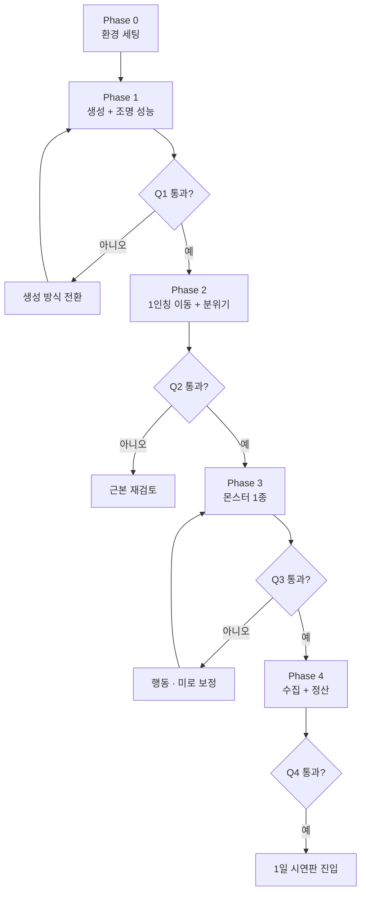
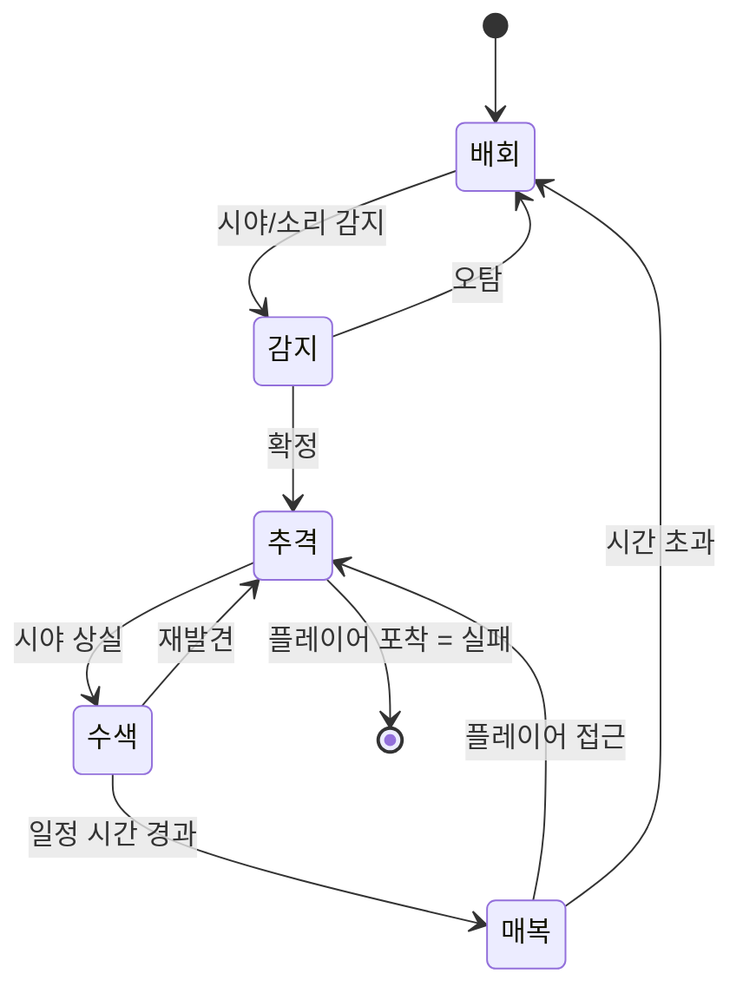
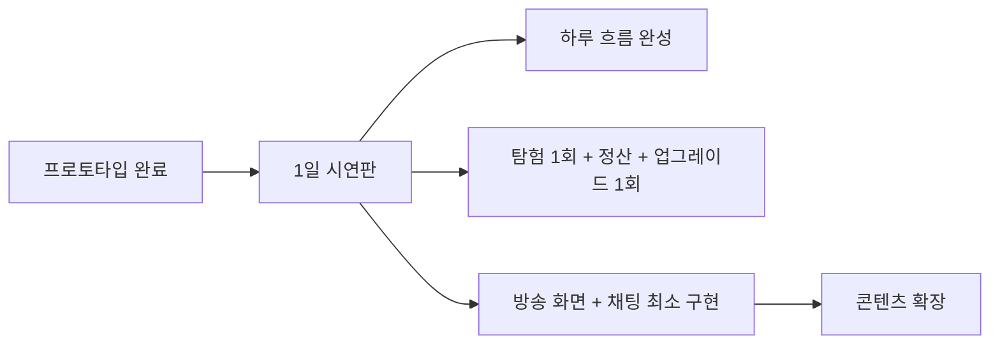

# 프로젝트 R — 프로토타입 개발 문서

기획서 v0.2 기준 · 핵심 재미 검증용
Version 0.2 · 2026.08

---

## 0. 이 문서의 목적

프로토타입은 게임을 만드는 단계가 아니라, 이 게임을 만들어도 되는지 판정하는 단계다. 따라서 만들 것과 만들지 않을 것을 먼저 정한다.

| 만드는 것 | 만들지 않는 것 |
|---|---|
| 백룸 탐험 1회 | 육성 시스템 전체 |
| 생성 및 조명 성능 검증 | 미니게임, 알바 |
| "무서운가" 검증 | 채팅, 후원 시스템 |
| 수집 → 정산 한 사이클 | 아트, 사운드 완성도 |
| 활동 공통 규격 껍데기 | 스트리머 선택, DLC 구조 |

백룸 탐험 10분이 그 자체로 재미없으면 육성 시스템은 아무것도 살리지 못한다. 그래서 탐험만 먼저 만든다.

---

## 1. 검증 질문

프로토타입이 답해야 할 질문은 네 개다.

| # | 질문 | 판정 방식 |
|---|---|---|
| Q1 | 절차적 생성과 형광등 조명이 목표 프레임에서 돌아가는가 | 정량 측정 |
| Q2 | 몬스터 없이 손전등만 들고 10분 걷는 게 무서운가 | 외부 테스터 관찰 |
| Q3 | 추격과 은신이 운이 아니라 실력으로 느껴지는가 | 외부 테스터 관찰 |
| Q4 | 수집과 정산 사이클에 만족감이 있는가 | 외부 테스터 관찰 |

실패했을 때의 대응:

| 질문 | 실패 시 |
|---|---|
| Q1 | 생성 방식 전환 (WFC 또는 방 이어붙이기) |
| Q2 | 프로젝트 근본 재검토. 아트, 사운드, 공간 설계 전면 재고 |
| Q3 | 미로 생성 보정 강화 또는 몬스터 행동 재설계 |
| Q4 | 인벤토리 격자 규칙 또는 보상 곡선 조정 |

네 개 중 Q2가 가장 중요하다. 몬스터는 공포의 결과이지 원인이 아니다. 빈 공간이 무섭지 않으면 무엇을 넣어도 무섭지 않다.

---

## 2. 개발 단계



---

## Phase 0 — 환경 세팅

**목표**: 이후 단계에서 구조를 다시 짜는 일이 없도록 최소한의 뼈대만 세운다.

**작업**

- Unity 프로젝트 생성, 렌더 파이프라인 결정
- 폴더 구조 정의
- Git + LFS 세팅
- PersistentManager 뼈대 (DontDestroyOnLoad)
- IActivity 인터페이스 정의
- ActivityResult 데이터 클래스 정의
- 씬 3개 생성: HomeScene(빈 껍데기), LoadingScene, BackroomsScene

### 활동 공통 규격을 먼저 잡는 이유

백룸을 게임 전체로 만들면 이후 미니게임과 알바를 붙일 때 반드시 다시 짜게 된다. 내용이 비어 있어도 좋으니 처음부터 백룸을 여러 활동 중 하나로 취급한다.

```csharp
public interface IActivity
{
    int SlotCost { get; }                  // 소요 시간대
    bool CanEnter(GameState state);
    void Begin(GameState state);
    ActivityResult End();
}

public class ActivityResult
{
    public int DonationDelta;              // 후원금 변동
    public int ViewerDelta;                // 시청자 변동
    public ConditionDelta Condition;       // 수면/배고픔/기분/피로
    public List<ItemInstance> Items;
    public bool IsFailure;
    public List<string> Flags;
}
```

### 렌더 파이프라인 판단 기준

| 선택 | 유리한 경우 |
|---|---|
| URP | 성능 여유 확보 우선, 실시간 조명 다수, 저사양 대응 |
| HDRP | 조명 품질 최우선, 사양 요구를 감수 |
| Built-in | 팀이 이미 익숙하고 참고 자료 확보가 쉬운 경우 |

백룸은 형광등이 많고 저사양 대응이 중요하므로 URP를 먼저 검토한다.

**완료 기준**: 빈 씬 사이를 오갈 수 있고 상태가 유지된다.

---

## Phase 1 — 맵 생성과 조명 성능

**목표**: 프로젝트 최대 기술 위험을 가장 먼저 제거한다.

**작업**

- 방·복도 프리팹 3~5종 제작. 형태만 잡은 박스 수준으로 충분
- 프리팹별 조명 굽기
- 재귀적 백트래킹 미로 생성 구현
- 생성 보정 세 가지 적용
  - 순환로 추가 (벽 일부 무작위 제거)
  - 막다른 길 비율 상한
  - 탈출 경로 도달 가능성 검증
- 프리팹 조립 방식으로 실행 중 배치
- 이음새 라이트 프로브 보정
- 시드 저장 및 재현 기능

절차적 생성 버그는 재현이 안 되면 잡을 수 없다. 시드 저장은 이 단계에서 넣는다. 나중에 넣으면 이미 한참 헤맨 뒤다.

### 프리팹 굽기 혼합 방식

```
[사전 작업]                    [실행 중]

프리팹 A ─ 조명 굽기 완료  ──▶  ┌───┬───┬───┐
프리팹 B ─ 조명 굽기 완료  ──▶  │ A │ C │ B │
프리팹 C ─ 조명 굽기 완료  ──▶  ├───┼───┼───┤
                                │ B │ A │ A │  ← 조립만 수행
                                ├───┼───┼───┤
                                │ C │ B │ C │
                                └───┴───┴───┘
                                  △
                                  └─ 이음새만 프로브 보정
```

### 측정 항목

| 항목 | 측정 방법 | 목표 |
|---|---|---|
| 프레임레이트 | 최악 구간(넓은 홀, 시야 개방) 기준 | 목표 사양에서 안정 |
| 생성 시간 | 맵 1개 생성 소요 시간 | 로딩 화면으로 가릴 수 있는 수준 |
| 드로우콜 | 프로파일러 | 목표치 이내 |
| 메모리 | 장시간 플레이 시 증가량 | 누수 없음 |
| 막다른 길 비율 | 생성 결과 통계 | 상한 이내 |
| 순환로 개수 | 생성 결과 통계 | 최소치 이상 |

### 판정

| 결과 | 조치 |
|---|---|
| 통과 | 목표 사양에서 프레임 안정. Phase 2 진행 |
| 경계 | 프리팹 수를 줄이거나 오클루전 컬링을 강화한 뒤 재측정 |
| 실패 | 생성 방식 전환. 1순위 WFC, 2순위 BSP + 순환로 연결, 3순위 방 이어붙이기 |

이 단계에 배정한 기간의 절반이 지나도 답이 안 나오면, 붙잡고 있지 말고 즉시 생성 방식을 바꾼다.

**완료 기준**: 랜덤 맵이 생성되고, 목표 프레임을 유지하며, 시드로 재현된다.

---

## Phase 2 — 1인칭 이동과 분위기

**목표**: 몬스터 없이 무서운지 검증한다.

**작업**

- 1인칭 캐릭터 조작 (걷기, 달리기, 앉기)
- 손전등 (배터리 소모, 흔들림)
- 발소리 (재질별 구분)
- 형광등 환경음
- 공간 잔향 (방 크기 반응)
- 랜드마크 오브젝트 배치
- 탈출 지점 배치와 탈출 처리

### 사운드에 예산을 쓴다

이 단계에서 아트는 형태만 잡은 박스여도 되지만 사운드는 근사치 이상이어야 한다. 소리 없이 테스트하면 Q2의 답이 나오지 않는다.

- 형광등 웅웅거림 — 백룸 환경음의 핵심
- 발소리 — 카펫, 타일, 콘크리트 구분
- 공간 잔향 — 동적 변화
- 정적 — 소리를 빼는 것도 설계다
- 미세한 환경음 — 환풍기, 물방울, 먼 곳의 소리

### 랜드마크

"여기 아까 왔던 데다"라고 플레이어가 스스로 알아채는 순간이 백룸의 정체성이다. 완전 무작위 공간은 무섭지 않고 짜증만 난다.

| 유형 | 예시 |
|---|---|
| 손상 | 벽 얼룩, 깨진 타일, 그을음 |
| 오브젝트 | 넘어진 의자, 버려진 상자, 문 |
| 조명 | 색이 다른 형광등, 깜빡이는 등, 꺼진 구역 |
| 흔적 | 낙서, 발자국, 화살표 |

### 테스트 방법

1. 개발자가 아닌 외부 테스터 3~5명 확보
2. 아무 설명 없이 10분간 플레이
3. 관찰 항목
   - 몇 분에 지루해하는가
   - 뒤를 돌아보는가
   - 소리에 반응하는가
   - 길을 잃었다고 느끼는가, 짜증내는가
   - 랜드마크를 알아채는가
4. 플레이 후 질문 (유도 없이)
   - 어떤 느낌이었나요
   - 다시 하고 싶나요

### 판정

| 결과 | 조치 |
|---|---|
| 통과 | 긴장감 유지, 뒤를 돌아봄, 다시 하고 싶다는 반응 |
| 경계 | 지루하지만 싫지는 않음. 사운드와 랜드마크 보강 후 재테스트 |
| 실패 | 몇 분 안에 지루해하고 길 잃음이 짜증으로만 작동. 아트 방향, 공간 규모, 사운드를 전면 재설계 |

**완료 기준**: 외부 테스터가 몬스터 없이도 긴장한다.

---

## Phase 3 — 몬스터 1종

**목표**: 추격과 은신이 실력으로 느껴지는지 검증한다.

**작업**

- NavMesh 세팅. 절차적 생성이므로 실행 중 굽기 필요 (NavMeshSurface)
- 몬스터 1종 구현. 시각 추적형이 가장 직관적이다
- 상태 전이: 배회 → 감지 → 추격 → 수색 → 매복 → 복귀
- 은신 시스템 (앉기, 오브젝트 뒤, 시야 차단)
- 몬스터 소리 (거리별, 방향별)
- 조우 시 실패 처리 (기절, 탐험 종료)

### 몬스터 상태 전이



### 판단력이 있어 보이게 만들기

플레이어는 내부 로직을 볼 수 없다. 구현 세부는 기획서 7.5절을 따르고, 여기서는 그중 소리 설계에 집중한다.

발소리가 멀어지다가 멈추는 순간, 플레이어 머릿속에서 "기다리고 있다"가 완성된다. 이 정적 하나가 복잡한 판단 로직보다 강력하다.

기술 참고:

- NavMesh — 실행 중 굽기 필요
- 수색 로직 — 지점별 가중치 방식. 복잡한 경로 탐색 불필요
- 소리 감지 — 플레이어 행동별 소음 반경 이벤트 발행 (걷기 < 달리기, 앉기는 무음)

### 판정

| 결과 | 조치 |
|---|---|
| 통과 | 도망쳐서 살아남았을 때 내가 잘했다고 느낀다 |
| 경계 | 긴장은 되지만 대처법을 모르겠다. 소리로 정보를 더 노출 |
| 실패 | 막다른 길에서 죽으면 생성 문제이므로 순환로 보정 강화. 뭐가 일어났는지 모르면 소리 설계 재작업 |

**완료 기준**: 실패했을 때 운이 나빴다가 아니라 내가 실수했다고 느낀다.

---

## Phase 4 — 수집과 정산

**목표**: 탐험 1회가 완결된 경험이 되는지 검증한다.

**작업**

- 칸 기반 격자 인벤토리
- 이상물체 프리팹 5~8종. 형태를 제각각으로 (1x1, 2x1, 2x3, 1x4)
- 습득, 배치, 버리기
- 방송 시간 제한 타이머
- 탈출 시 정산 화면
- 실패 시 불이익 처리 (인벤토리 전부 소실)
- ActivityResult 반환과 HomeScene 복귀
- 활동 도중 강제 종료 시 되돌리기

### 격자 인벤토리

```
┌───┬───┬───┬───┬───┬───┐
│███│███│   │▓▓▓│▓▓▓│▓▓▓│   ███ 2x2
├───┼───┼───┼───┼───┼───┤   ▓▓▓ 3x2
│███│███│   │▓▓▓│▓▓▓│▓▓▓│   ░░░ 1x1
├───┼───┼───┼───┼───┼───┤   ▒▒▒ 1x4
│░░░│░░░│   │   │   │   │
├───┼───┼───┼───┼───┼───┤
│▒▒▒│▒▒▒│▒▒▒│▒▒▒│   │   │
└───┴───┴───┴───┴───┴───┘
```

형태를 다양하게 만들어 정리하는 재미를 유도한다. 무게 개념은 넣지 않는다. 관리 부담만 늘어난다.

### 확인 항목

| 항목 | 확인 내용 |
|---|---|
| 수집 만족감 | 좋은 물건을 주웠을 때 기쁜가 |
| 공간 고민 | 이걸 넣으려면 뭘 버릴지 고민이 생기는가 |
| 시간 압박 | 타이머가 실제로 결정을 바꾸는가 |
| 욕심 충돌 | 한 개만 더와 지금 나가자가 충돌하는가 |
| 정산 쾌감 | 탈출 후 정산 화면이 보상으로 느껴지는가 |
| 실패 감정 | 전부 잃었을 때 다시 하겠다인가 그만두겠다인가 |

마지막 두 항목이 실패 불이익 조정의 근거가 된다. 기획서 7.7절 기준으로 인벤토리 전부 소실을 적용하되, 테스터가 그만두고 싶어 하면 아래 순서로 완화한다.

1. 방송 사고 클립 보상
2. 회수 기회
3. 보험 업그레이드
4. 일부 소실로 전환

**완료 기준**: 탐험 1회(10~15분)가 시작과 중간과 끝을 가진 완결된 경험이 된다.

---

## 3. 기간 배분

인원과 숙련도에 따라 달라지므로 절대 기간 대신 상대 비중과 위험도로 관리한다.

| 단계 | 비중 | 성격 |
|---|---|---|
| Phase 0 | 가장 짧음 | 세팅 |
| Phase 1 | 가장 김 | 최대 기술 위험 |
| Phase 2 | 김 | 최중요 검증 |
| Phase 3 | 김 | 구현 난이도 높음 |
| Phase 4 | 중간 | 비교적 예측 가능 |

Phase 1에서 막히면 일정이 늘어나는 것으로 끝나지 않고 생성 방식을 바꿔야 한다. 이 단계만 기한을 명시적으로 정해두고, 절반이 지나도 성능이 안 나오면 전환한다.

---

## 4. 이 단계에서 만들지 않는 것

혼동을 막기 위해 명시한다.

육성 시스템, 하루 시간대 구조, 컨디션 네 수치, 채팅, 후원과 시청자 수, 컨셉 유지 시스템, 미니게임, 알바, 시그널 등급과 소포, 스트리머 선택과 DLC 구조, 2D 아바타와 방송 화면, 저장 시스템(되돌리기 제외), 아트 완성도.

예외는 두 가지다.

- IActivity와 ActivityResult 규격은 Phase 0에서 껍데기라도 만든다
- 시드 저장은 Phase 1에서 반드시 만든다

---

## 5. 프로토타입 이후



1일 시연판의 목표는 하루가 온전히 돌아가는 것이다. 아침에 일어나 방송하고, 백룸에 들어가고, 정산받고, 업그레이드하고, 잠든다. 이 하루가 재밌으면 게임이 성립한다.

그 다음 우선순위:

1. 층 다양성 확보 — 엔드리스 반복감을 막는 사실상 유일한 수단
2. 미니게임 5~6종
3. 알바 — 게임 초반 인상을 좌우
4. 컨셉 유지 시스템 — 최대 차별화 요소
5. 아바타 꾸미기 — 스크린샷 공유를 통한 홍보 자산
6. 영어 현지화

---

## 6. 점검 목록

### Phase 0
```
□ Unity 프로젝트 + 렌더 파이프라인 결정
□ Git LFS
□ PersistentManager 뼈대
□ IActivity 인터페이스
□ ActivityResult 클래스
□ 씬 3개 생성 및 전환 확인
```

### Phase 1
```
□ 방·복도 프리팹 3~5종
□ 프리팹별 조명 굽기
□ 재귀적 백트래킹 생성
□ 순환로 추가 보정
□ 막다른 길 상한 보정
□ 탈출 경로 검증
□ 시드 저장 및 재현
□ 성능 측정 및 판정
```

### Phase 2
```
□ 1인칭 조작
□ 손전등 + 배터리
□ 발소리 (재질별)
□ 형광등 환경음
□ 공간 잔향
□ 랜드마크 배치
□ 탈출 지점
□ 외부 테스터 3~5명 테스트 및 판정
```

### Phase 3
```
□ 실행 중 NavMesh 굽기
□ 몬스터 1종 (시각 추적형)
□ 상태 전이 구현
□ 은신 시스템
□ 몬스터 소리 (거리·방향)
□ 실패 처리
□ 테스트 및 판정
```

### Phase 4
```
□ 격자 인벤토리
□ 이상물체 5~8종 (형태 다양)
□ 습득·배치·버리기
□ 방송 시간 타이머
□ 정산 화면
□ 실패 불이익
□ ActivityResult 반환
□ 되돌리기 처리
□ 테스트 및 판정
```

---

## 부록. 판정 기록 양식

| 단계 | 검증 질문 | 측정 및 관찰 결과 | 판정 | 조치 |
|---|---|---|---|---|
| Phase 1 | Q1 성능 | | 통과 / 경계 / 실패 | |
| Phase 2 | Q2 공포 | | 통과 / 경계 / 실패 | |
| Phase 3 | Q3 실력감 | | 통과 / 경계 / 실패 | |
| Phase 4 | Q4 수집 | | 통과 / 경계 / 실패 | |
